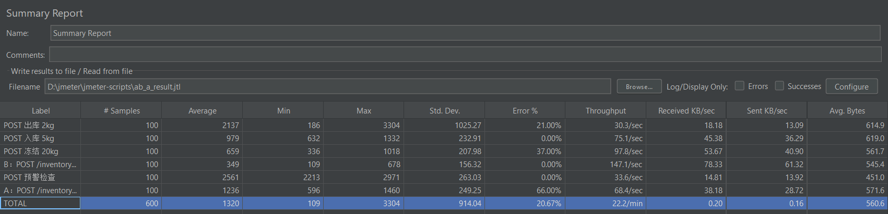

# 农批履约中台 — AI 驱动的农产品智能履约管理系统

面向农产品冷链履约场景的 DDD 四层多模块系统，集成 **Spring AI 1.1.2 智能客服**（对话 / RAG / Manus 智能体 / ToolCalling / MCP），配合 **FEFO 三重并发锁控制** + **Outbox 事务消息** 确保强一致。前端基于 **Next.js 15 + React 19 + shadcn/ui**。

## 项目简介

基于 DDD 分层架构（api / app / domain / infrastructure），围绕"批次、库存、预警"三大核心业务域实现农产品履约全流程，覆盖入库、出库、转库、库存调整、冻结、终止、预警处理等场景，并在 AI 模块提供智能客服入口：

- 多轮对话 + 工具调用（8 个业务工具覆盖 3 大业务域）
- RAG 知识库问答（PGVector + QueryRewriter）
- Manus ReAct 多步智能体
- MCP 协议接入天气 / 文件系统工具
- ChatMemory 持久化到 Redis（自实现 Repository + TTL 自动清理），前端刷新页面可恢复历史对话

## 技术栈

### 后端

| 分类 | 技术 |
|---|---|
| 基础框架 | Java 21 + Spring Boot 3.5.15 + Maven 多模块 |
| 架构 | DDD 四层（api / app / domain / infrastructure） |
| 数据访问 | MyBatis-Plus 3.5.17 + 原生 MyBatis @Update（复杂字段表达式） |
| 数据库 | MySQL 8（主）+ PostgreSQL + PGVector（RAG 向量） |
| 缓存 / 分布式锁 | Redis 7 + Redisson 3.51.0 |
| 消息队列 | RabbitMQ（Outbox 模式保证 DB ↔ MQ 一致性） |
| AI 框架 | Spring AI 1.1.2 + PGVectorStore |
| AI Provider | Ollama / 通义千问（DashScope）/ 日日新（OpenAI 兼容协议） |
| AI 多轮记忆 | 自实现 RedisChatMemoryRepository（TTL 1h + {role, content} DTO 序列化） |
| Agent 框架 | Manus（BaseAgent → ReActAgent → ToolCallAgent → NongpiManus 继承链） |
| MCP | spring-ai-mcp-client + 自实现 weather-mcp-server.js（Node.js） |
| 任务调度 | @Scheduled（OutboxMessageRelay：2s 扫描 + IN_FLIGHT 超时恢复） |
| 虚拟线程 | spring.threads.virtual.enabled=true（承载 SSE 流式 + MCP 进程） |

### 前端

| 分类 | 技术 |
|---|---|
| 框架 | Next.js 15（App Router / Turbopack）+ React 19 + TypeScript |
| UI | shadcn/ui + Tailwind CSS |
| 状态 / 数据 | @tanstack/react-query |
| 图表 | Recharts + GSAP（数字滚动） |
| 通信 | SSE（AI 流式对话） + HTTP REST |

## 核心技术亮点

1. **FEFO 三重并发控制**：Redis ZSet 缓存最早批次 → Redisson 互斥锁 → MySQL InnoDB 行级 X 锁 + MP 乐观锁版本号。抢锁失败的降级逻辑和释放时机。
2. **Outbox 模式保证 DB ↔ MQ 一致**：业务表 + t_lot_event（PENDING）同事务 → OutboxMessageRelay 2s 扫描抢占 IN_FLIGHT（in_flight_at）→ Publisher Confirm 转 PUBLISHED / MQ 消费 idempotent 补偿 FEFO 缓存。
3. **库存原子操作两条路径**：批量入库/出库/转库用 MyBatis @Update + 事务；手动调整用 adjustStock + @Retryable（独立事务，低并发）。
4. **Spring AI 全家桶落地**：ChatClient + ToolCalling（@Tool）+ RAG（文档分片 + 关键词增强 + PGVector）+ Manus ReAct Agent + MCP Client/Server 双向。
5. **ChatMemory 自实现 Redis 持久化**：Spring AI 1.1.2 未提供 Redis ChatMemoryRepository，自实现 4 方法；Message 子类不可变 → 转 `{role, content}` DTO 序列化；TTL 1h 自动清理；前端 localStorage 存 chatId + `/history` 接口刷新恢复 + 三层容错。
6. **流式 fallback 方案**：servlet 环境 `ChatClient.stream()` Flux 静默挂死，改用同步 `.call()` + 虚拟线程按 2 字符拆分模拟流式，工具调用能力不丢失。
7. **NongpiManus prototype scope**：`messageList` 有状态实例字段，`@Scope("prototype")` + `getBean()` 每次新实例，避免多用户并发上下文串话。


## JMeter 并发压测报告（2026-09-11）

> 环境：本机（Lenovo Win11 / Java 21 / JMeter 5.6.3），后端 Spring Boot 3.5.15 直连 8080。压测脚本与原始结果保留在 `D:\jmeter\jmeter-scripts\`（*.jmx 可复跑，*.jtl 为可信结果）。

### 一、业务防线验证：并发出库防超卖（三档并发对比）

压测设计：`qty=2` 请求 × N 线程并发，可用库存 500kg。资源耗尽后由**数据库原子 SQL**（`WHERE (total_qty-frozen_qty) >= qty`）精确拦截。

| 并发 | 接口 | 成功 | 失败 | 失败性质 | 扣减验证 |
|------|------|------|------|---------|---------|
| **100** | 出库 | 79 | 21 | **422 业务拦截**（原子 SQL WHERE） | 余 **1.50kg**，分毫不差 |
| **400** | 出库 | 211 | 189 | 422×0 + Connection refused×189 | 扣 422kg，211×2 精确 |
| **500** | 出库 | 218 | 282 | Connection refused×282 | 扣 436kg，218×2 精确 |
| **400** | 冻结 | 30 | 370 | 422×186 + Connection refused×184 | 冻 600kg，30×20 精确，余 **0** |

**核心结论：业务防线在任意并发下始终精确**——到达数据库层的请求全部被原子 SQL 正确放行或拦截，库存永不为负、扣减量可精确对账（成功数 × 2 = 扣减总量）。

### 二、⚠️ 压测揭示的隐藏瓶颈：分布式锁等待占满 Tomcat worker

调大 Tomcat 线程池（`server.tomcat.threads.max: 400`）后 **400 并发仍有 189 个连接被拒**，根因不在线程数：

```
400 并发出库 → 全部请求竞争同一把 Redisson 锁 lock:lot:{lotNo}
→ 仅 1 个拿到锁，其余 399 个阻塞在 tryLock(waitTime=5s)
→ Tomcat 400 个 worker 线程全被"等待锁"占住 → 新连接无线程处理
→ accept queue 满 → Connection refused
```

**教训**：同步锁 + 同步 HTTP 模型下，**锁等待时间是吞吐上限的决定因素**。瞬时并发超过"锁可并行数"时连接会被拒绝，这不是配置问题而是设计边界。生产方案：异步化（锁内操作改事件驱动）或队列削峰。这也是本项目选择"同批次串行 + 锁粒度到批次"而非"全库存一把锁"的原因——锁粒度越小，并行度越高。

**复验**：400 并发下冻结接口出现**同样规模**的连接拒绝（184/400 vs 出库 189/400），且业务防线同样精确（冻满 600kg 余 0）——确认瓶颈是**系统级**（锁等待占满 Tomcat worker），非单一接口特例。

### 三、其余并发场景验证（100 并发，全部预期拦截）

| 场景 | 并发压测 | 成功 | 拦截 | 验证机制 |
|------|---------|------|------|---------|
| **并发入库** | 100×5kg | 100 | 0 | 批次号冲突重试（5次）+ 库存原子累加 + **Outbox 100 条事件全部 PUBLISHED** |
| **并发冻结** | 100×20kg vs 1270 可用 | 63 | 37（422） | 与出库同一套原子 SQL，冻结精确止于可用量 |
| **并发转库** | 100×1kg vs 批次5kg | 5 | 95（409/锁） | Redisson 锁串行化，批次恰好出清（FULLY_OUT） |
| **并发处理预警** | 100×同一条 | 10 | 90（409 ALREADY_HANDLED） | 领域状态机防重，预警只处理 1 次 |
| **并发预警检查** | 100 并发 | 100 | 0 | 原子幂等（修复后），0 重复预警 |

### 四、⭐ A/B 对比：乐观锁读-改-写 vs 数据库原子 SQL

| 指标 | adjustStock（乐观锁+重试） | freezeStock（原子 SQL） |
|------|---------------------------|------------------------|
| 平均响应 | 1236ms | **349ms（快 3.5 倍）** |
| 吞吐 | 68.4/s | **147/s（高 2.1 倍）** |
| 成功率 | 34%（66 个 409 锁冲突） | **100%** |

**结论**：高并发写同一行时，乐观锁读-改-写频繁冲突（version 不匹配 → 重试 3 次仍失败 → 409）；原子 SQL 把校验写进 WHERE，由数据库行锁串行化，**冲突在 DB 内部消化，应用层零重试**。项目因此对高频扣减（出库/冻结）采用原子 SQL，仅对低并发手动调整保留乐观锁——**按并发风险分级选择方案**。

### 五、💥 压测发现的真实 Bug 与修复（幂等 TOCTOU）


- **现象**：100 并发 `POST /api/alerts/check` 后，同一批次同一规则生成 **10 条重复预警**（首测 5 条膨胀到 25 条）。
- **根因**：原幂等逻辑是"先查后插"（`findUnhandledByLotNo` → 存在则跳过 → 插入），典型 **TOCTOU 竞态**——并发下所有线程同时查到"无未处理记录"，随后全部插入。
- **修复**：新增 `AlertRecordMapper.insertIfNotExists`，用 `INSERT ... SELECT ... WHERE NOT EXISTS` **一条 SQL 原子完成"检查+插入"**。
- **复测**：修复后 100 并发 check，预警记录保持 7 条不变，**重复归零**。

### 六、压测复现方法

```bash
cd D:/jmeter/apache-jmeter-5.6.3/bin
# 以并发出库为例（其余同理，替换 -t 的 jmx 文件）
./jmeter -n -t D:/jmeter/jmeter-scripts/nongpi_outbound_stress.jmx -l outbound_result.jtl
# GUI 查看：启动 jmeter.bat → 添加"聚合报告"监听器 → Browse 打开 .jtl
```

---

## 目录结构

```
nongpi-fulfillment/
├─ ai/                     # AI 模块（ChatClient / RAG / ToolCalling / Agent / MCP）
│  └─ src/main/
│     ├─ java/com/nongpi/fulfillment/ai/
│     │  ├─ api/            # 对外接口 AiController（4 端点 + history）
│     │  ├─ app/            # 应用编排 NongpiAssistantApp
│     │  ├─ agent/          # Manus ReAct 智能体继承链
│     │  ├─ rag/            # RAG 流水线（切分/重写/分类/AdvisorFactory）
│     │  ├─ tools/          # NongpiToolSet 业务工具
│     │  ├─ config/         # AiConfig（ChatClient + ChatMemory + 日志）
│     │  └─ infrastructure/ # RedisChatMemoryRepository
│     └─ resources/mcp/     # weather-mcp-server.js + mcp-servers.json
├─ alert/                   # 预警模块（DDD）
├─ bootstrap/               # Spring Boot 启动入口 + 集成配置
├─ common/                  # 通用组件（API DTO / 异常 / JWT / Response）
├─ inventory/               # 库存模块（DDD）
├─ lot/                     # 批次模块（DDD） + Outbox 扫描 + FEFO 缓存
├─ frontend/                # Next.js 15 前端
│  ├─ app/                  # 页面路由：/login /dashboard /lots /inventory /alerts /ai
│  ├─ components/           # 全局组件（PageHeader / EmptyState / StatusBadge / AiChatPanel / AgentStepCard / Sidebar / AppShell 等）
│  ├─ lib/                  # api.ts / ai-sse.ts / auth-context / toast 等
│  └─ components/ui/        # shadcn/ui 基础组件（button / card / dialog / input / badge …）
├─ sql/
│  └─ create_nongpi_tables.sql        # MySQL 建表脚本（lot / inventory / alert / outbox 事件 / t_mq_consume_log 等）
├─ docs/
│  └─ specs/2026-08-27-ai-smart-customer-service-design.md  # AI 客服模块设计规格

├─ docker-compose.yml       # 中间件一键启动（MySQL + Redis + RabbitMQ + PostgreSQL + PGVector + Ollama）
├─ pom.xml                  # 父 pom，声明 6 子模块（lot/inventory/alert/ai/bootstrap/common）
├─ mvnw / mvnw.cmd          # Maven wrapper
├─ smoke-test.bat           # 冒烟测试脚本（启动后快速校验核心端点）
├─ start.sh                 # Linux / Git Bash 启动脚本
└─ ddd-vs-mvc-comparison.md # DDD vs 传统 MVC 分层对比说明
```

## 环境准备

- JDK 21+
- Maven 3.8+（或使用仓库内置 `mvnw` / `mvnw.cmd`）
- Node.js 20+（前端 `npm install && npm run dev`）
- 中间件（可直接 `docker compose up -d`）：MySQL 8 / Redis 7 / RabbitMQ 3 / PostgreSQL 16 + pgvector 扩展 / Ollama

## 快速启动

### 1. 启动中间件

```bash
docker compose up -d
```

### 2. 初始化数据库

执行 `sql/create_nongpi_tables.sql` 到 MySQL 库（默认库名 `nongpi`，用户名/密码按 application.yml）。

### 3. 启动后端（开发期默认端口 8080）

```bash
# Windows
mvnw.cmd spring-boot:run -pl bootstrap

# Linux / macOS
./mvnw spring-boot:run -pl bootstrap
```

默认管理员账号：`admin / admin123`（[AuthController.java](common/src/main/java/com/nongpi/fulfillment/common/api/AuthController.java) 硬编码，生产务必替换为数据库用户表）。

### 4. 启动前端（默认端口 3000）

```bash
cd frontend
npm install
npm run dev
```

浏览器访问 http://localhost:3000 → 登录 → 进入仪表盘。

## AI 模块接口（4 端点 + history）

| 端点 | Method | 说明 |
|---|---|---|
| `/api/ai/chat?message=&chatId=` | POST | 同步对话（记忆 + 业务工具 + MCP） |
| `/api/ai/chat/stream?message=&chatId=` | GET（SSE） | 流式对话（虚拟线程 fallback 模拟流式） |
| `/api/ai/chat/rag?message=&chatId=` | GET（SSE） | RAG 知识库流式回答 |
| `/api/ai/manus/chat?message=` | GET（SSE） | Manus ReAct 多步智能体（SSE 推送 think/action 步骤） |
| `/api/ai/history?chatId=` | GET | 从 Redis ChatMemory 获取历史对话，供前端刷新恢复 |

## 运行检查清单

1. 后端启动日志：**Tomcat started on port 8080**
2. RabbitMQ 管理台 http://localhost:15672 （guest/guest）→ 检查 FEFO 交换器 + 队列存在
3. Redis：`SET chatmemory:xxx` 能写入 → 验证 ChatMemory 走 Redis
4. 前端登录成功 → 仪表盘加载 → 批次管理 / 库存管理 / 预警管理三页可用
5. AI 对话页三模式（对话 / 知识库 / 智能体）均能返回内容
6. 演示天气 MCP：对话模式发 **"今天北京天气怎么样"** → 应返回真实 API 数据

## 许可与贡献

- 欢迎提交 Issue / PR 完善履约场景
- 建议使用约定式提交：`feat(模块): 简述` / `fix: 简述` / `docs: 简述` / `chore: 简述`
